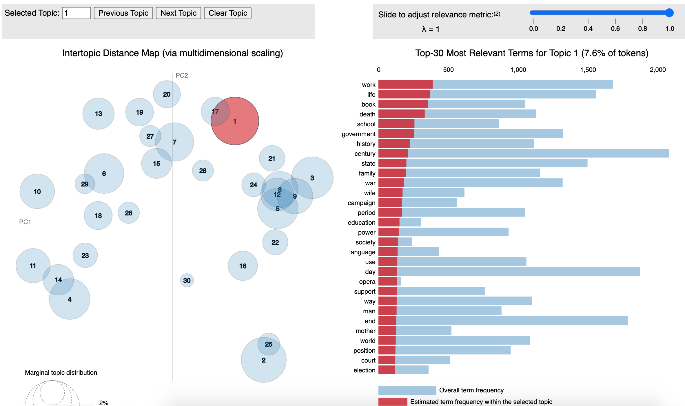

### LDA Demo

This project contains code and some sample data to give a brief introduction of how LDA works, how the input/output looks like. What basic steps need to be taken.

    

### Prerequisite
The project uses Gensim, LDAviz, NLTK, so they need to be installed.

